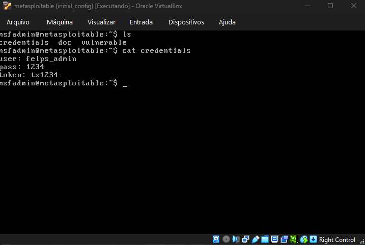
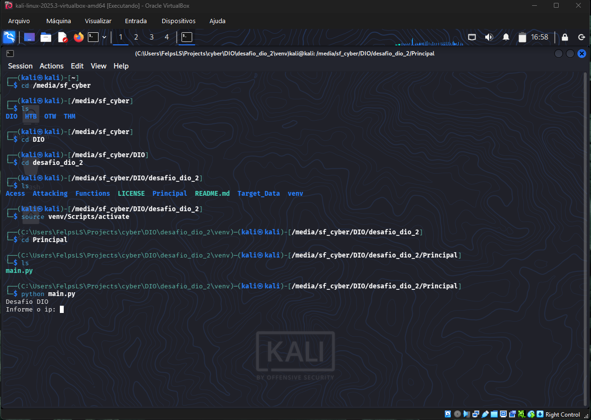
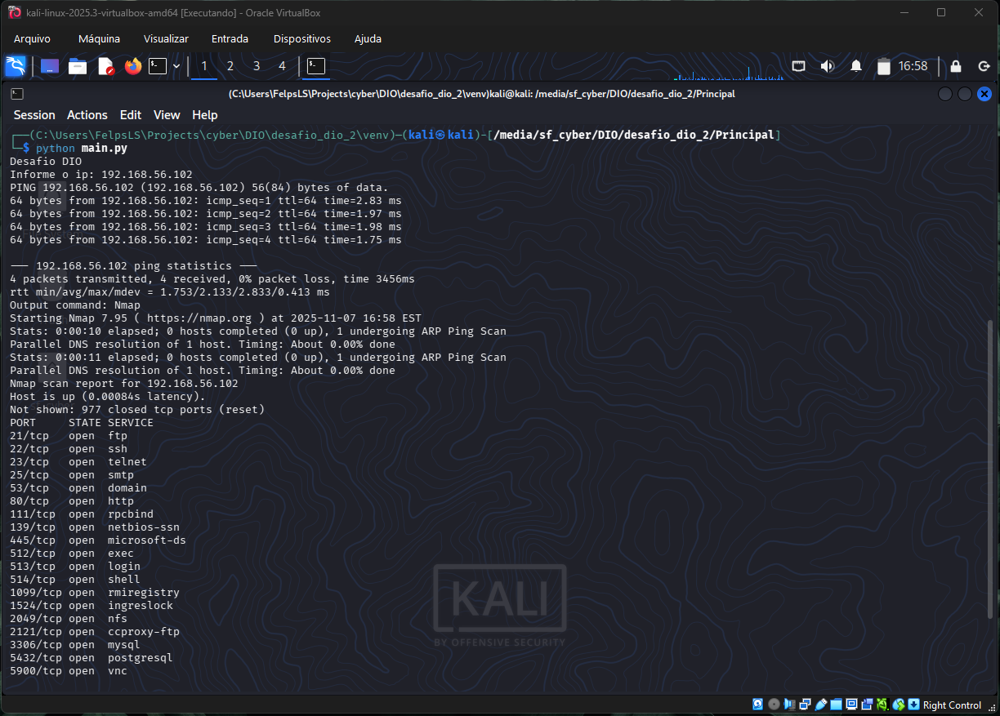
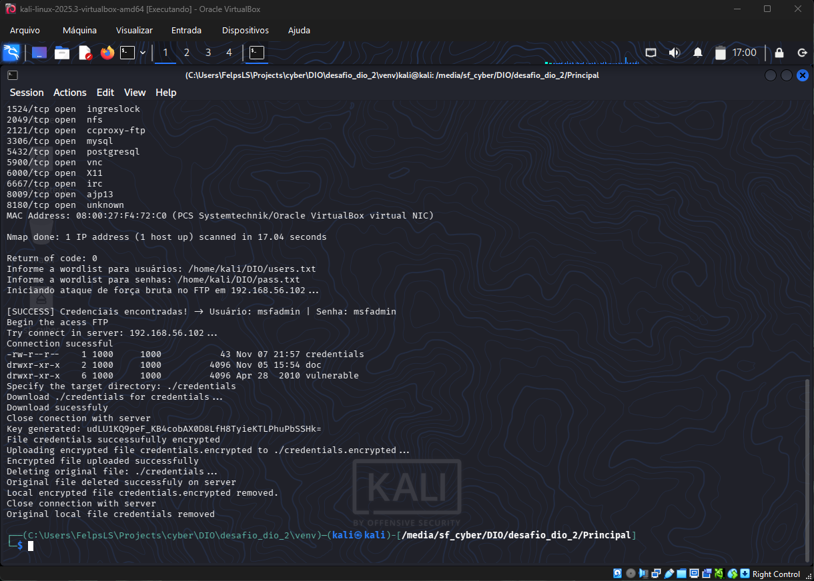
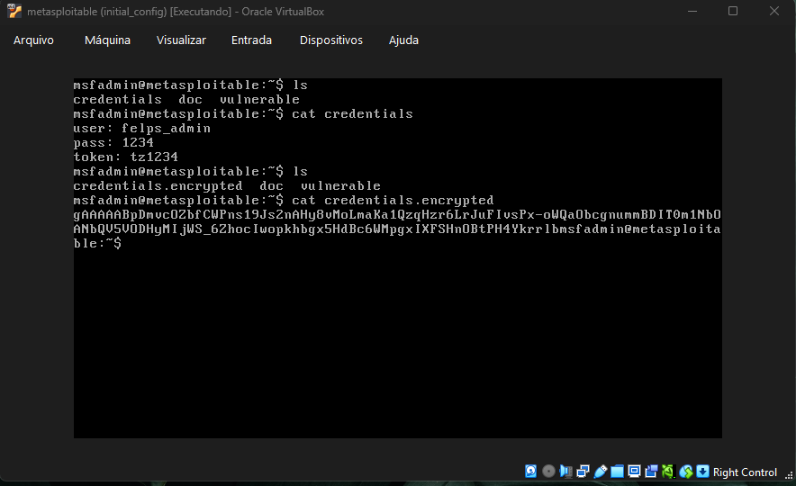

# desafio_dio_2

Simulando um Malware de Captura de Dados Simples em Python e Aprendendo a se Proteger

O projeto, intitulado  **"desafio_dio_2"** , é uma simulação de um Malware de Captura de Dados Simples em Python, com foco específico na execução de um ataque de **ransomware** via FTP.

O código é modularizado, dividindo as tarefas em módulos de mapeamento, força bruta, acesso a FTP e a lógica de criptografia (ransomware).

## Resumo do Fluxo do Ataque

O ataque é orquestrado pela função principal (`main()`) e segue os seguintes passos:

1. **Entrada de Dados:** O usuário informa o **IP** do servidor alvo (ex: Metasploitable 2) e os caminhos para os *wordlists* de usuários e senhas.
2. **Mapeamento (`Functions/mapping.py`):** O sistema executa comandos de **ping** (`responseServer`) e **Nmap** (`mappingServer`) para verificar a conectividade e mapear portas abertas, como as portas 21 (FTP), 80 (HTTP) e 445 (SMB).
3. **Força Bruta (`Attacking/brute_force.py`):** É executado um ataque de força bruta contra o FTP usando a ferramenta **Medusa** (`medusa -h [ip] -U [user\_file] -P [pass\_file] -M ftp -t 6`). Em caso de sucesso, as credenciais (`user` e `passw`) são extraídas via expressão regular.
4. **Acesso e Download (`Acess/ftp.py`):** Usando as credenciais encontradas, o programa se conecta ao FTP (`acess\_ftp`), lista o diretório (`ftp.dir()`) e solicita ao usuário o **caminho remoto** do arquivo a ser criptografado. O arquivo é então baixado para o ambiente local (`ftp.retrbinary()`).
5. **Criptografia (Ransomware) (`Attacking/ransoware.py`):**
   * Uma **chave de criptografia** é gerada (`genarate\_key()`).
   * O arquivo local baixado é criptografado (`encrypt\_file()`) usando a biblioteca **`cryptography.fernet`** e salvo com a extensão `.encrypted`.
6. **Substituição no Servidor (`Acess/ftp.py`):** A função `upload\_and\_delete()` é chamada para finalizar o ataque:
   * O arquivo criptografado (`local\_encrypted\_file`) é enviado ao servidor (`ftp.storbinary()`).
   * O **arquivo original (não criptografado) no servidor é deletado** (`ftp.delete()`), completando a simulação do ransomware.
7. **Limpeza:** As cópias locais do arquivo original e do arquivo criptografado são removidas (`os.remove()`).

## Detalhamento dos Módulos Principais

| Arquivo/Módulo                        | Funções               | Descrição                                                                                                                                                                |
| -------------------------------------- | ----------------------- | -------------------------------------------------------------------------------------------------------------------------------------------------------------------------- |
| **`Attacking/ransoware.py`**   | `genarate_key()`      | Gera uma chave secreta Fernet.                                                                                                                                             |
|                                        | `encrypt_file()`      | Lê um arquivo, o criptografa (AES) e salva com a extensão `.encrypted`.                                                                                                |
|                                        | `decrypt_file()`      | Descriptografa o arquivo, simulando a restauração após o "pagamento do resgate".                                                                                        |
| **`Acess/ftp.py`**             | `acess_ftp()`         | Conecta ao FTP, lista o diretório, baixa o arquivo alvo e retorna o caminho local e remoto.                                                                               |
|                                        | `upload_and_delete()` | Gerencia a**substituição**do arquivo: faz o**upload**da versão `.encrypted`e a**deleção**da versão original no servidor, além da limpeza local. |
| **`Attacking/brute_force.py`** | `b_f()`               | Executa o Medusa e utiliza `re`(expressões regulares) para extrair as credenciais `User`e `Password`da saída.                                                      |
